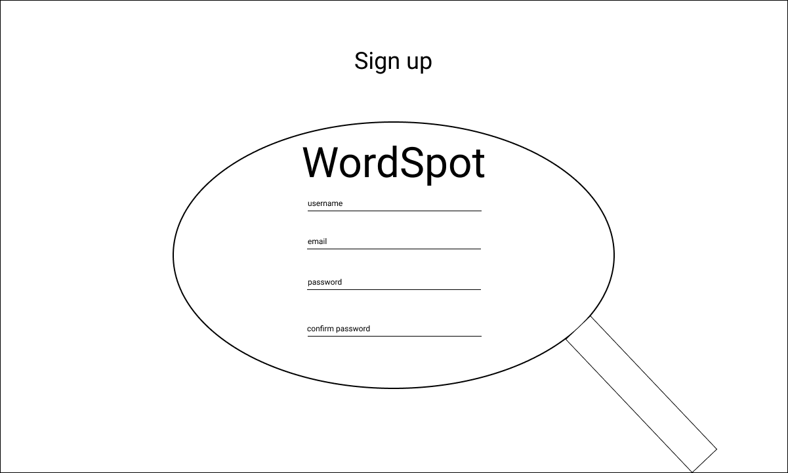
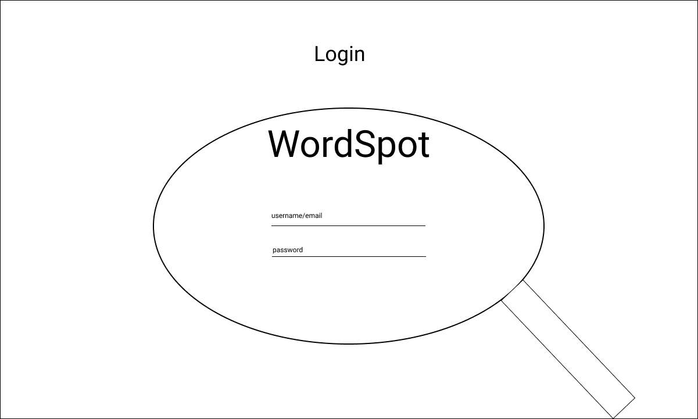
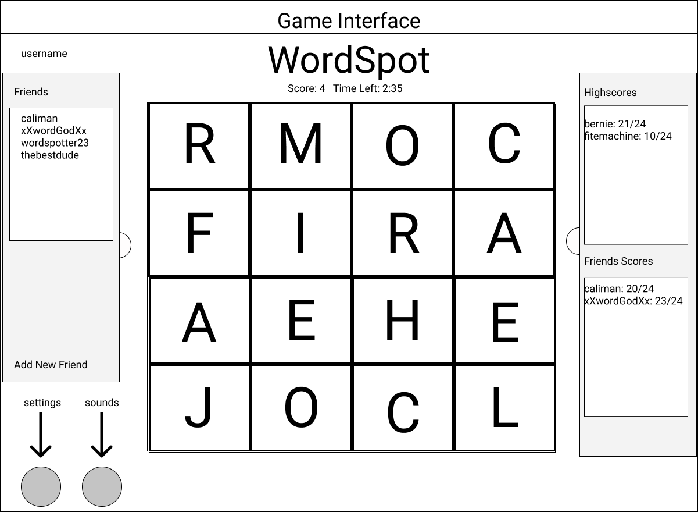

# WordSpot

## MVP

### 1. User Auth

- Create new user
- Login/Logout

### 2. Friends

- Friend/Unfriend
- Send/Accept challenges

### 3. LetterBoards

- Connect letters together to find a word
- Score Counter
- Timer
- Settings

### 4. Highscores

- HighScores for letterBoards
- Show friends scores

### 5. User Generated LetterBoards

- User creates new board with custom letters
- Graph search algorithm generates board orientation with most words

### 6. Music and Sound Effects

- Background music
- Gameplay sound effects

---

   

## Bonus Features

### 1. Hints

- Give antonym, synonyms, or definition

### 2. Two Player Game Mode

- Two players compete for words from the same letterboard

### 3. WordPick Game Mode

- Choose from 9 letters to pick a word
- Shuffle feature

---

   

## Database Schema

### 1. User

- id
- username
- email
- hashedPass
- lastLoggedInDate

### 2. FriendsList

- id
- userId
- friendsUsernames

### 3. LetterBoard

- id
- userId
- letters
- words
- hints

### 4. Score

- id
- userId
- letterBoardId
- score
- date

### 5. Challenges

- id
- createdDate
- updatedDate
- letterBoardId
- challengeSenderId
- challengedUserId
- accepted

---

   

## Backend Routes

### 1. Sessions

- POST /api/session -- Login user
- DELETE /api/session -- Logout user

### 2. Users

- POST /api/users/ -- Account creation
- GET /api/users/:userId -- Get account info and friends list
- PATCH /api/users/:userId -- Edit user info
- DELETE /api/users/:userId/:letterBoardId -- Deletes userId for a letterBoard

### 3. LetterBoards

- POST /api/letterBoards -- Creates user generated letterBoard
- GET /api/letterBoards/:letterBoardId - Get letterBoard info

### 4. Scores

- POST /api/scores/:letterBoardId/:userId -- Posts score for user
- GET /api/scores/:letterBoardId -- Gets scores for letterBoard

### 5. Challenges

- POST /api/challenges/ -- Creates a challenge
- GET /api/challenges/:userId -- Gets all challenges
- DELETE /api/challenges/:challengeId -- Deletes a challenge

---

   

## Components

### 1. SignUp

### 2. Login

### 3. Game

### 4. LetterBoard

### 5. LetterBoardColumn

### 6. Letter

### 7. Timer

### 8. Settings

- Music
- SoundEffects
- Timed
- User Info Edit

### 9. FriendsList

### 10. Footer

### 11. SideBar

1. Highscores

> - World highscores
> - Friends highscores

2. Friends

> - Friends list
> - Add a friend

3. Challenges

> - Sent challenges
> - Received challenges

---

   

## Wireframe

### 1. Signup

   

### 2. Login

   

### 3. Game Interface

   

   

## Tech Requirements

- alembic
- [chakra-ui](https://chakra-ui.com/) (for drawer and form components)
- email-validator
- datetime (for updating datetime column in db)
- Flask
- Flask-WTF
- Flask Cors
- [Flask-Login](https://flask-login.readthedocs.io/en/) (for user authentication)
- Flask-Migrate
- Flask-SQLAlchemy
- pyscopg2-binary
- python-dateutil
- python-dotenv
- React
- React-router-dom
- SQLAlchemy
- [PyEnchant](http://pyenchant.github.io/pyenchant/) (for spellcheck)
- [PyDictionary](https://pypi.org/project/PyDictionary/) (for word hints)
- [werkzeug](https://werkzeug.palletsprojects.com/en/1.0.x/) (for password security)
